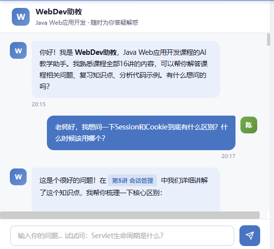
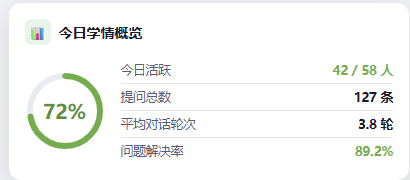
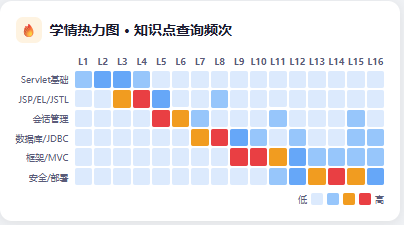
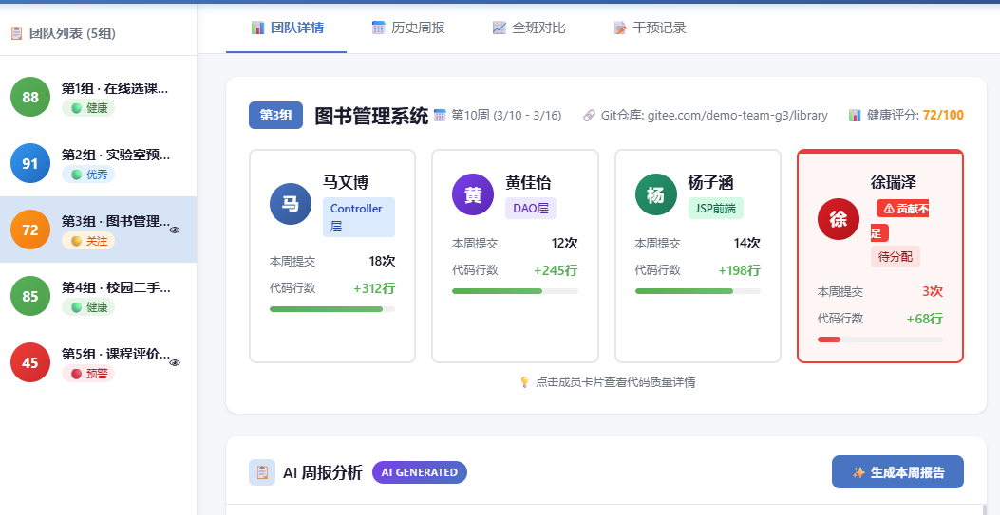
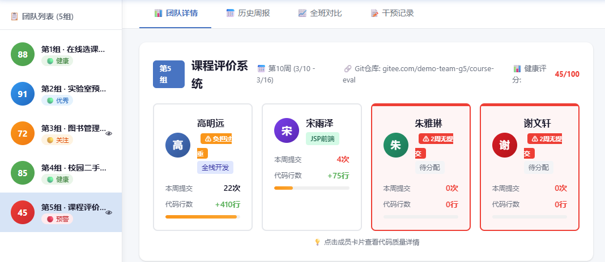
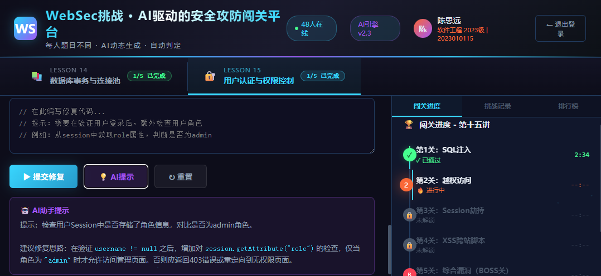
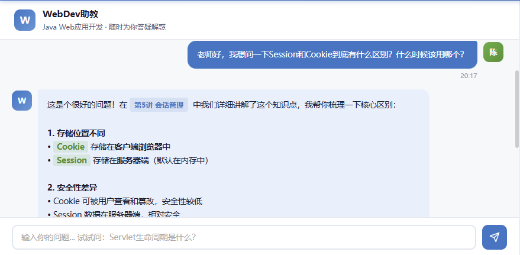
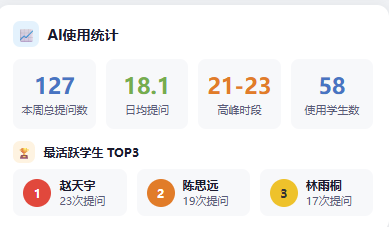
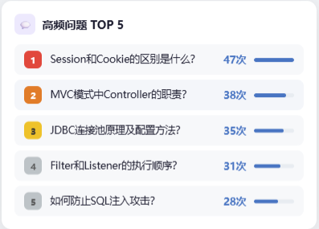

<!-- _class: cover_d -->
<!-- _header: "" -->
<!-- _paginate: "" -->

# Java Web应用开发 · 课外教学展示

###### Supplementary Teaching Demonstration · Pre-class & Post-class Activities

课程: Java Web应用开发 | 32学时(理论24+实验8) | 2学分
授课对象: 计算机科学与技术专业本科三年级 · 2个教学班 · 78人
XXX大学 · XXX学院 · 教师：XXX

## 展示概要

###### Presentation Overview

<!-- _class: cols2_ol_ci fglass toc_a -->
<!-- _footer: "" -->
<!-- _header: "OVERVIEW" -->
<!-- _paginate: "" -->

- [课程概况与教学理念](#3)
- [整体课程AI教学设计](#5)
- [课前环节：数据驱动的精准备课](#7)
- [课中回顾（简要）](#11)
- [课后环节：AI驱动的持续反馈](#12)
- [教学闭环与成效数据](#16)
- [AI赋能编程教育研究成果](#20)

## 课程概况

###### Course Overview

<div class="flex-row">
<div>

**课程基本信息**

| 项目 | 内容 |
|:---|:---|
| 课程名称 | Java Web应用开发 |
| 课程性质 | 专业核心课 |
| 学时/学分 | 32学时（理论24+实验8）/ 2学分 |
| 授课对象 | 计算机科学与技术 · 大三 |
| 班级规模 | 2个教学班 · 78人 |
| 开课学期 | 2025秋季学期 |

</div>
<div>

**课程内容体系（16讲）**

| 模块 | 讲次 | 主题 |
|:---|:---:|:---|
| 基础篇 | 1-4 | Servlet/JSP基础、HTTP协议 |
| 进阶篇 | 5-8 | MVC架构、数据库访问、Session |
| 实战篇 | 9-12 | 项目开发、前后端交互、AJAX |
| 安全篇 | 13-16 | Web安全、认证授权、部署运维 |

</div>
</div>

## 教学理念与核心问题

<!-- _class: bq-blue -->

> **以学生为中心、数据驱动、AI赋能的编程课程教学模式**

**传统编程课教学面临的三大痛点：**

| 痛点 | 具体表现 | AI解决思路 |
|:---|:---|:---|
| **学情黑箱** | 教师凭经验备课，不知学生真实薄弱点 | AI智能体采集课前数据，精准学情诊断 |
| **反馈滞后** | 作业批改周期长，错过最佳纠正窗口 | AI即时代码审查，当天反馈 |
| **协作失衡** | 团队项目"搭便车"现象难以量化发现 | AI自动分析Git数据，贡献度透明化 |

<div class="ai-box">

**课程设计目标**：不是用AI替代学生思考，而是用AI让教师"看见"每个学生，让反馈"即时"到达，让协作"透明"可追踪
**课程思政融合**：以"数字中国建设与网络安全"为主线，将**国家意识、职业伦理、依法治网、工匠精神**有机融入16讲技术教学
</div>

## 整体课程AI教学设计

###### Course-level AI Teaching Design

<!-- _class: bq-green -->

> **4项自主研发AI工具，贯穿16讲 · 覆盖课前-课中-课后全周期**

| AI工具 | 课前 | 课中 | 课后 | 覆盖讲次 |
|:---|:---|:---|:---|:---:|
| **WebDev助教**（教学智能体） | 预习问答 · 学情诊断 | — | 24h答疑 · 数据回流 | 1-16讲 |
| **AI个性化实验生成** | 分层任务 · 一人一题 | — | — | 5-16讲 |
| **WebSec挑战**（攻防闯关） | — | AI动态出题 · 游戏化训练 | 课后延续闯关 | 13-16讲 |
| **Code Review Battle** | — | 人vs AI代码审查 | AI使用反思 | 9-16讲 |
| **TeamCoach**（团队教练） | 团队周报 · 风险预警 | — | Git贡献追踪 · AI周报 | 9-16讲 |

<div class="ai-badge">4项创新 · 覆盖全部6大AI教学情境</div>

## 课程级数据闭环设计

###### Course-level Data-Driven Closed Loop

**每一讲都遵循同一个数据驱动流程，16讲形成持续迭代的教学改进链：**

```
 第N讲课前              第N讲课中              第N讲课后             第N+1讲课前
┌──────────────┐   ┌──────────────┐   ┌──────────────┐   ┌──────────────┐
│ WebDev助教   │   │ WebSec/CRB   │   │ AI代码审查    │   │ 数据回流     │
│ 学情诊断     │──→│ 实时数据干预  │──→│ 个性化反馈    │──→│ 调整下讲重点 │
│ TeamCoach周报│   │ 教师即时调整  │   │ TeamCoach追踪│   │ 关注特定学生  │
└──────────────┘   └──────────────┘   └──────────────┘   └──────────────┘
```

<div class="data-highlight">

**关键设计**：课后数据自动回流到下一讲的课前分析，形成跨讲次的持续改进闭环。以下以第十五讲"用户认证与权限控制"为典型案例，展示课前-课后的具体实施。

</div>

## 课前环节 · 以第十五讲为例

###### Pre-class Activities · Lecture 15 as Example

<!-- _class: bq-green -->

> **课前目标：数据驱动的精准备课，让每一个教学决策都有数据支撑**

```
课前3天                    课前1天                    上课当天
┌──────────────┐    ┌──────────────┐    ┌──────────────┐
│ WebDev助教   │    │ 学情数据分析  │    │ 教师精准备课  │
│ 发布预习任务  │ ──→│ 热力图+薄弱点 │ ──→│ 调整教学重点 │
│ 学生自主探索  │    │ 高频问题TOP5 │    │ 关注特定学生  │
└──────────────┘    └──────────────┘    └──────────────┘
       │                   │                    │
   TeamCoach           AI个性化实验             数据驱动
  上周团队周报          分层任务生成            教学决策
```

## <a href="https://gerryfan0706.github.io/coursecompetation/demo-tools/webdev-assistant/">WebDev助教</a> · 学情诊断与预习推送

<div class="ai-badge">创新一：课程专属教学智能体（RAG）</div>

<div class="flex-row">
<div>

**智能体特点：**
- 基于16讲课件+实验手册+常见错误库构建的RAG系统
- 使用国产大模型（DeepSeek），只回答本课程问题
- 每讲课前发布预习引导问题，自动采集学情

**第十五讲学情数据：**
- 参与率72.4%，人均3轮对话
- 高峰时段21:00-23:00（传统教学无法覆盖）
- **关键发现：78%学生混淆Session.invalidate()和removeAttribute()**

</div>
<div>



<div style="display: flex; gap: 1px;">


</div>

</div>
</div>

## 数据驱动备课 + 个性化分层

###### Data-Driven Preparation & Personalized Tasks

<div class="flex-row">
<div>

<div class="ai-badge">数据驱动精准教学</div>

**学情数据 → 教师调整教学重点：**

| 内容 | 原计划 | 调整后 |
|:---|:---:|:---:|
| 认证概念 | 10min | 5min（已掌握） |
| Session安全 | 8min | **15min（薄弱点）** |

**不是凭经验，而是凭数据。**

</div>
<div>

<div class="ai-badge">一人一题 · 分层任务</div>

**AI为不同层次学生生成差异化实验：**

| 层级 | 占比 | 任务要求 |
|:---|:---:|:---|
| 基础层 | ~20% | 基本RBAC登录登出 |
| 进阶层 | ~60% | +Session攻击防护 |
| 挑战层 | ~20% | +BCrypt+CSRF+审计 |

**同一难度不同业务场景，代码相似度降至4.7%**

</div>
</div>

## <a href="https://gerryfan0706.github.io/coursecompetation/demo-tools/team-coach/">TeamCoach</a> · 课前团队状态检查

###### Team Project AI Coach - Pre-class Status

<div class="ai-badge">创新三：团队项目AI教练</div>

<div class="flex-row">
<div>

**TeamCoach自动分析Git提交，生成团队周报：**

- 第3组：Service层代码无人负责，赵六(化名)本周仅改README
- 第5组：2名成员连续两周无代码提交

**教师据此决策**：课堂中重点关注薄弱学生，修复实践环节给予针对性指导

<div class="data-highlight">

**用数据而非主观印象来关注学生** — 让团队协作中的"搭便车"现象无所遁形

</div>

</div>
<div>




</div>
</div>

## 课中回顾（详见课堂实录视频）

###### In-class Review (See Full Recording)

<!-- _class: bq-purple -->

> **第十五讲课堂实录（45分钟）已在另一段视频中完整呈现**

| 阶段 | 时间 | 核心活动 | AI工具 |
|:---|:---:|:---|:---|
| 数据驱动导入 | 0-5min | 展示学情数据+权限漏洞演示 | WebDev助教+TeamCoach |
| 安全攻防闯关 | 5-16min | 聚焦第2关"越权访问" | WebSec挑战平台 |
| 核心概念精讲 | 16-24min | 认证+Session安全+RBAC | — |
| AI代码评审对战 | 24-36min | 人工审查 vs AI审查+辩论 | Code Review Battle |
| 修复验证与总结 | 36-45min | 分组修复+测试验证 | WebDev助教答疑 |

**数据驱动即时干预**：教师根据WebSec平台实时通过率决定是否暂停闯关、集中讲解
**思政融合**：安全攻防训练自然引出"依法治网"与《个人信息保护法》，RBAC权限设计对应"权责明晰"的治理理念，让学生认识到每一行代码都关乎用户隐私与数字安全

## 课后环节 · 以第十五讲为例

###### Post-class Activities · Lecture 15 as Example

<!-- _class: bq-green -->

> **课后目标：AI驱动的持续反馈与迭代改进，让学习不止步于课堂**

```
课后当天                课后1-3天            课后持续
┌──────────────┐    ┌──────────────┐    ┌──────────────┐
│ WebSec挑战   │    │ AI代码审查    │    │ TeamCoach   │
│ 完成第4-5关  │    │ 个性化反馈报告│    │ 持续Git追踪  │
│ 自主延续训练 │    │ 二次迭代修改  │    │ 下周团队周报  │
└──────────────┘    └──────────────┘    └──────────────┘
       │                   │                    │
   WebDev助教           学生改进              数据回流
  24h持续答疑          代码验证            下次课前分析
```

## <a href="https://gerryfan0706.github.io/coursecompetation/demo-tools/websec-challenge/">WebSec挑战</a> · 课后延续 + AI代码审查

###### Post-class: WebSec Challenge & AI Code Review

<div class="flex-row">
<div>

<div class="ai-badge">创新二：攻防闯关平台</div>

**课后自主完成第4-5关：**
- 第4关：XSS跨站脚本攻击
- 第5关（BOSS关）：综合漏洞诊断
- AI为每人生成不同漏洞代码，无法抄袭
- 课后完成率超90%



</div>
<div>

<div class="ai-badge">多维智能评价反馈</div>

**AI四维代码审查 → 个性化反馈报告：**
- 功能正确性 / 安全性 / 知识点覆盖 / 代码规范
- **核心原则：不给完整代码，只指方向**

**学生迭代证据（修改前→修改后）：**
- `session.removeAttribute("user")` → `session.invalidate()`
- 仅判断`isLoggedIn` → 检查`getRole()`角色权限
- 编译通过率：首次67% → 二次提交89%

</div>
</div>

## <a href="https://gerryfan0706.github.io/coursecompetation/demo-tools/team-coach/">TeamCoach</a> · 团队项目持续监控

###### TeamCoach - Continuous Team Monitoring

<div class="ai-badge">创新三：团队项目AI教练</div>

<div class="flex-row">
<div>

**四维监控：**

| 维度 | 自动检测 |
|:---|:---|
| 贡献度 | 每人代码行数、提交频率 |
| 分工合理性 | 是否只改JSP/配置文件 |
| 搭便车预警 | 连续无提交、截止日突击 |
| 代码风格 | 命名规范、包结构一致性 |

**数据闭环**：课后团队数据 → 下周自动生成新周报 → 下次课前教师分析

</div>
<div>


</div>
</div>

## <a href="https://gerryfan0706.github.io/coursecompetation/demo-tools/webdev-assistant/">WebDev助教</a> · 课后持续支持

###### AI Teaching Assistant - 24/7 Post-class Support

<div class="ai-badge">创新一：24小时个性化学习支持</div>

<div class="flex-row">
<div>

**智能体课后功能：**
- 知识点答疑：结合课程内容精准定位问题层
- 错误诊断：学生粘贴报错信息，AI定位原因
- 学习路径推荐：根据水平推荐进阶内容

**课后数据：** 24h内新增68条提问，高峰21:00-23:00
**教师可查看课后提问记录**，高频问题纳入下次课教学调整

</div>
<div>






</div>
</div>

## 教学闭环 · 跨讲次数据流转

<!-- _class: bq-blue -->

> **完整的AI赋能教学闭环：每个环节产生数据，每个决策基于数据**

```
  ┌────────────┐     ┌────────────┐     ┌────────────┐
  │   课前      │     │   课中     │     │   课后     │
  │ WebDev助教  │ ──→ │ WebSec挑战 │ ──→ │ AI代码审查 │
  │ 学情诊断    │     │ 攻防闯关    │     │ 个性化反馈 │
  │ TeamCoach  │     │ Code Review │     │ TeamCoach │
  │ 团队周报    │     │ Battle对战 │     │ 持续追踪   │
  └────────────┘     └────────────┘     └────────────┘
        ↑                                      │
        │         数据持续回流                    │
        └──────────────────────────────────────┘
```

**实例**：第十四讲课后78%学生混淆Session管理 → 第十五讲课前增加教学时间(8min→15min) → 课后混淆率降至15%

## 课程成效数据


<div class="ai-badge">实验组58人 vs 对照组62人 · 同一教师 · 同一教材 · 唯一变量：AI工具</div>

> **SQL注入识别率 12.1% → 89.7%（+77.6pp）· 代码抄袭率 45% → 5%**

| 指标 | 引入AI前 | 引入AI后 | 变化 |
|:---|:---:|:---:|:---|
| 首次编译通过率 | 67.3% | 88.5% | **+21.2pp** |
| 代码相似度 | 45.2% | 4.7% | **-40.5pp** |
| SQL注入识别率 | 12.1% | 89.7% | **+77.6pp** |
| 教师审查时间(单份) | 33min | 12min | **-63.7%** |
| 学生满意度 | -- | 4.31/5 | Cronbach's alpha=0.87 |

<div class="data-highlight">

**92.6%的学生主动选择继续使用AI辅助学习** — 不是被要求使用，而是主动拥抱
**83.4%的学生认为AI建议需要批判性判断** — AI协作素养而非AI依赖的目标已被内化

</div>

## 六大AI教学情境全覆盖

###### Full Coverage of Six AI Teaching Scenarios

| 赛道要求的情境 | WebDev助教 | WebSec挑战 | TeamCoach | Code Review Battle |
|:---|:---:|:---:|:---:|:---:|
| 1. 学情数据采集与分析 | **课前提问分析** | **闯关数据追踪** | **Git贡献分析** | -- |
| 2. 数字资源整合与运用 | **RAG课程知识库** | **动态题库生成** | -- | -- |
| 3. 适配的教学场景设计 | -- | **个性化关卡** | **个性化任务** | **对抗场景** |
| 4. 多维智能评价反馈 | -- | **闯关评分** | **贡献度报告** | **人机评审对比** |
| 5. 师生机协同教学 | **AI助教角色** | **AI出题+学生解** | -- | **AI vs 人对战** |
| 6. 个性化学习支持 | **24h个性问答** | **自适应难度** | **薄弱点推荐** | -- |

<div class="ai-box">

**4项自主研发创新工具，覆盖全部6个赛道要求的AI教学情境，远超"至少2个"的要求**

</div>

## 课程思政融合与AI使用规范

<!-- _class: bq-red -->

> **价值引领 + 四道防线，实现"润物无声"的思政融合与AI规范使用**

<style scoped>
section .flex-row table { width: 100%; table-layout: fixed; font-size: 80%; word-break: break-all; white-space: normal; }
section .flex-row { gap: 20px; }
</style>

<div class="flex-row">
<div>

**课程思政——以"数字中国与网络安全"为主线：**

| 思政主题 | 融入方式 | 典型讲次 |
|:---|:---|:---|
| 依法治网 · 职业伦理 | 安全漏洞实战→《个人信息保护法》合规 | 第5、13-16讲 |
| 国家意识 · 技术自信 | HTTP请求→东数西算工程；国产开源生态 | 第1、3、6讲 |
| 工匠精神 · 责任担当 | 代码规范→数字基建质量；RBAC→权责明晰 | 第7、10、15讲 |
| AI伦理 · 批判思维 | Code Review Battle→AI不等于正确答案 | 第9-16讲 |

</div>
<div>

**AI使用四道防线：**

| 防线 | 机制 | 说明 |
|:---|:---|:---|
| 角色限定 | AI是诊断助手，不是代写工具 | 任务卡限定AI角色边界 |
| 输出约束 | 提示词要求输出问题位置，不输出完整代码 | 结构化提示词模板 |
| 数据隐私 | 学生数据校内服务器存储，不外传 | 符合《个人信息保护法》 |
| 诚信检测 | MOSS查重 + 个性化题目天然防抄袭 | 代码相似度<5% |

</div>
</div>

**教师人工复核机制**：AI反馈报告需教师审核后发放，关键评分由教师最终裁定

## 可复制推广模式

###### Replicable and Scalable Model

<!-- _class: bq-blue -->

> **"AI赋能编程课程教学"四位一体模式**

| 维度 | 内容 | 技术门槛 |
|:---|:---|:---|
| **智能体** | 课程专属RAG助教 | 大模型API + 向量数据库 |
| **攻防平台** | 游戏化安全训练 | 大模型API + JUnit测试 |
| **团队教练** | Git数据分析 + AI周报 | Python脚本 + 大模型API |
| **评审对战** | 人机对比代码审查 | 大模型API + Web界面 |

**核心依赖**：仅需大模型API + 基础Web开发能力，无需专用硬件
**已应用**：Java Web应用开发课程（2个教学班，78人）
**可推广**：所有编程类课程（数据结构、操作系统、软件工程...）

## AI赋能编程教育研究成果

###### AI-Empowered CS Education Research

<div class="flex-row">
<div>

**教改研究方向：**
- 系统引入AI辅助编程工具，采用严谨实验设计开展教学效果评价
- 深入研究AI工具对学生**学习动机、编程焦虑、协作学习、编程能力**的多维影响
- 揭示AI辅助编程教育中**认知脚手架与认知卸载的双重机制**

**教改研究成果：**
- 中科院一区Top期刊发表AI辅助编程教育论文 **2篇**
- 第九届中国计算机实践教育学术会议（CPEC 2025）**一等奖论文 + 最佳报告奖**

**课程建设：**
- 4项AI教学工具全部自主研发并开源
- 教学模式提炼为可复制的"四位一体"框架

</div>
<div>


</div>
</div>

## 总结

###### Key Takeaways

<!-- _class: bq-green -->

> **三个核心收获**

**1. 课前：AI让学情分析从"凭经验"变为"看数据"**
WebDev助教自动采集学情，TeamCoach追踪团队协作，每一个备课决策都有数据支撑

**2. 课后：AI让反馈从"延迟一周"变为"当天可达"**
个性化反馈报告+二次迭代修改+自动验证，学生在学习窗口未关闭时就获得改进指导

**3. 闭环：课前→课中→课后→下一讲，16讲形成持续改进链**
4项AI工具不是孤立使用，而是形成数据持续流动、跨讲次迭代的教学闭环

<div class="ai-box">

**AI不是降低了学习的门槛，而是提升了学习的天花板**

</div>

---

<!-- _class: lastpage -->
<!-- _footer: "" -->
<!-- _paginate: "" -->

###### 感谢聆听 Thank You

<div class="icons">

- <i class="fa-solid fa-graduation-cap"></i>
  XXX学院

- <i class="fa-solid fa-book-open"></i>
  Java Web 应用开发

</div>
